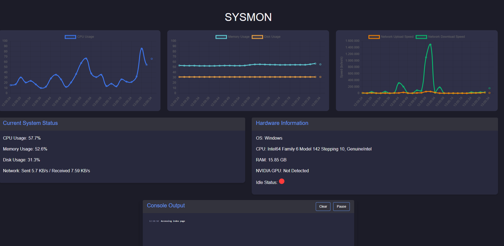

# sysmon

a very simple system monitor, made to explore some concepts in python.

- to run it, you gotta have python installed and then manually (for now) install the dependencies using "pip install"
- execute the SYSMON.py in the root folder
- open **http://127.0.0.1:5000** in your browser to see the output

### features
- measures system metrics and outputs them visually - similar to the windows task manager
- checks if the machine it runs on has a NVIDIA gpu or not
- checks if the user was afk for some time
- mirrors outputs of the python console and displays them

### how it works
- it utilizes a python flask backend to output to a web interface
- uses bootstrap5 and the jinja2 template engine
- runs a local server (thus you have to use your browser and localhost to access)
- uses chart.js for visualization
- some configurations can be made at the beginning of the py script (intervals, console filtering,...)

> [!WARNING]  
> - this is NOT a finished product, feel free to explore the code and submit suggestions, bugfixes etc.
> - upon closer inspections a couple of things could be improved, eg. using AJAX instead of passing inline scripts etc

### context
the program is a component of a larger project, in which the user can experiment by running (locally) different llms and playing around with the parameters
- this should provide insights on how many tokens get invested in the current task and how the system can handle different quantizations of the same model or different models
- surveillance of the local machine is imperative to conduct such a/b testing
- it is of uttermost importance, if the user has a capable nvidia gpu for memory dumping!
- i want to at some point make a daemon, that runs like a service in the background: It recognizes when the pc is idle, then initiates queued resource intensive ai tasks
- as programming such a daemon probably should´nt be done in python, it is currently beyond my capabilities - expect updates, once i am proficient enough in assembler ;)
